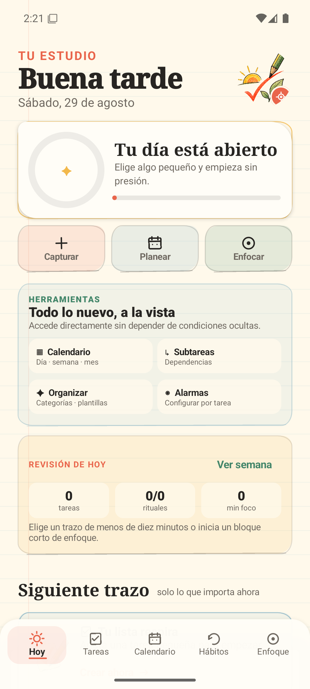
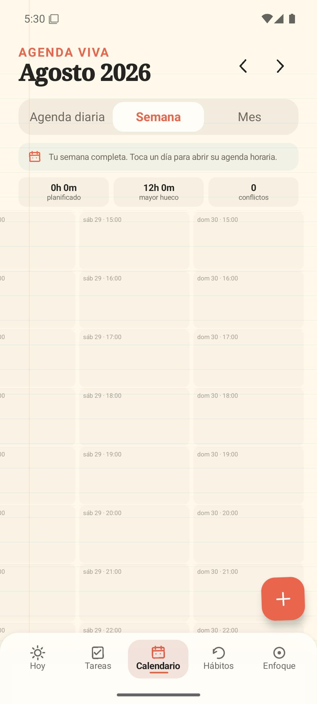
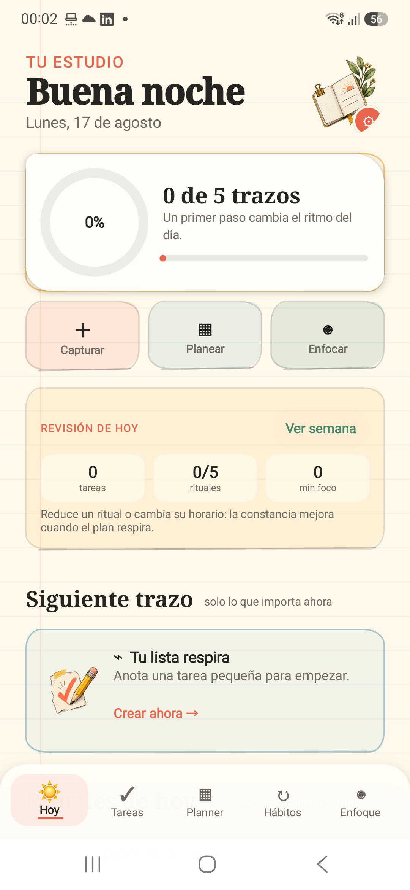

# Trazo

[](https://github.com/rck1996/trazo/actions/workflows/android-ci.yml)
[](https://github.com/rck1996/trazo/releases/latest)
[](https://developer.android.com/about/versions/oreo)
[](#privacidad)

Trazo es una aplicación Android offline para gestionar tareas y hábitos sin cuentas, anuncios ni conexión. Su interfaz mezcla un cuaderno de papel con trazos imperfectos, colores cálidos y microinteracciones discretas.

## La app

<p align="center">
  
  
  
</p>

La galería usa capturas reales de la aplicación ejecutándose en un teléfono Android. La interfaz también dispone de planner, widgets interactivos, tema claro/oscuro y modo minimalista monocromático.

## Descargar e instalar

Descarga el APK desde la [última versión publicada](https://github.com/rck1996/trazo/releases/latest). En Android, permite temporalmente la instalación desde la aplicación con la que abras el archivo y toca el APK para instalarlo.

> Los APK actuales son compilaciones de prueba firmadas localmente y pensadas para instalación directa. No son paquetes de Google Play.

## Funciones incluidas

- Crear, completar y eliminar tareas, con nota y marca de importancia.
- Dividir una tarea en subtareas marcables; el progreso aparece como `2/5` en tareas, agenda y planner.
- Organizar subtareas dependientes y recibir una confirmación al terminar toda la lista.
- Reutilizar configuraciones completas mediante plantillas y categorías compartidas editables.
- Crear hábitos con símbolo, categoría visual y días personalizados.
- Marcar el cumplimiento diario y calcular rachas según los días programados.
- Vista «Hoy» que reúne lo accionable y muestra progreso inmediato.
- Persistencia local privada en JSON versionado mediante `SharedPreferences`.
- Estados vacíos accionables, navegación clara y controles accesibles.
- Fechas opcionales y reprogramables para cada tarea.
- Calendario con agenda diaria, planner semanal y vista mensual.
- Agenda horaria diaria con bloques calculados por duración y reprogramación rápida.
- Arrastrar bloques del planner entre horas y días con precisión de 15 minutos.
- Pomodoro 25/5 o 50/10 asociado a una tarea pendiente.
- Centro de avisos con diagnóstico de permisos, próximo/último envío y prueba audible del modo elegido.
- Activar una alarma crítica por elemento con pantalla completa, completar y posponer.
- Resolver pendientes desde un cierre nocturno configurable.
- Agenda matinal y cierre del día independientes, con cualquier hora en formato `HH:MM`.
- Notificación persistente mientras el Pomodoro está activo.
- Ilustraciones originales estilo sketch para tomate, taza, encabezados y widgets, integradas sin conexión.
- Edición completa de tareas y hábitos conservando su historial.
- Duraciones Pomodoro personalizadas entre 1–180 minutos de enfoque y 1–60 de pausa.
- Widget de inicio con agenda del día, pilas deslizables de tareas y hábitos, acciones rápidas y accesos a Planner/Enfoque.
- Inicio reconstruido como un estudio diario: progreso circular animado, acciones rápidas y mensajes adaptativos.
- Filtros de tareas, historial visual de siete días y resumen de rachas para hábitos.
- Filtros combinables por estado, fecha y prioridad, más avance global de checklists.
- Transiciones direccionales entre secciones, cambio animado del calendario y respiración orgánica del Pomodoro.
- Seis widgets independientes e interactivos: resumen del día, hábito rápido, temporizador, tres próximas tareas, jardín de rituales y captura inteligente por voz.
- Modo Pomodoro de pantalla siempre activa, con brillo tenue, reloj OLED y dibujo animado adaptado a enfoque o descanso.
- Widget principal adaptativo: reparte su altura según el contenido y ofrece configuración independiente de secciones, prioridad compacta, Pomodoro, color y cantidad de tarjetas.
- Ilustraciones sketch por categoría de hábito: Hidratación, Autocuidado, Alimentación, Movimiento y Descanso.
- Copia de seguridad JSON local mediante los selectores de exportación e importación de Android.
- Recordatorios por tarea o hábito con cuatro entregas elegibles: notificación normal, alarma previa, alarma a la hora o ambas alarmas. La anticipación (5–30 min) y la duración sonora (15–60 s) son configurables; incluyen recuperación tras reinicio y acciones «Hecho», `+10 min` y `+30 min`.
- Cada tarea y hábito puede elegir su propio modo de recordatorio, independientemente de la preferencia general.
- Hábitos medibles por veces, minutos o pasos, con meta personalizada y progreso diario.
- Captura inteligente en español con fechas, horas, prioridad y etiquetas, además de dictado por voz.
- Búsqueda por texto y etiquetas, archivo, papelera recuperable y acción Deshacer.
- Estadísticas semanales de tareas, hábitos y Pomodoro.
- Tema claro/oscuro/de sistema con contraste adaptado, texto ampliado, movimiento reducido y respuesta háptica configurable.

## Ejecutar

1. Abre esta carpeta con Android Studio Quail 1 (2026.1.1) o compatible.
2. Usa JDK 17 y permite que Android Studio instale Android SDK 36.0 si lo solicita.
3. Sincroniza Gradle y ejecuta el módulo `app` en un emulador o dispositivo Android 8.0+.

El proyecto fija AGP 9.2.1, Gradle 9.4.1, Kotlin/Compose Compiler 2.3.21, Android SDK 36.0 estable y Compose BOM 2026.06.00.

## Arquitectura mínima

```text
UI Compose → TrazoViewModel → LocalStore → SharedPreferences / JSON
                      ↓
               modelos inmutables
```

No se añadieron cuentas, red, analítica, inyección de dependencias ni base de datos: el tamaño actual no los justifica. `LocalStore` mantiene un campo de versión para permitir migraciones y copias portables.

## Privacidad

Trazo no crea cuentas, no contiene analítica y no envía tareas, hábitos, grabaciones ni estadísticas a servidores. La captura por voz usa el reconocedor configurado en Android y la aplicación conserva únicamente el texto confirmado. Las copias de seguridad solo se crean cuando la persona las exporta mediante el selector de archivos del sistema.

## Verificación

Desde Android Studio o con el Gradle Wrapper incluido:

```bash
./gradlew test
./gradlew assembleDebug
```

El APK instalable más reciente también se copia a `artifacts/Trazo-3.5.0-debug.apk`.

Para instalarlo por USB con el teléfono autorizado:

```powershell
adb install -r -t artifacts\Trazo-3.5.0-debug.apk
```

Las pruebas unitarias cubren el cálculo de rachas, incluidos días no programados y días omitidos.

## CI/CD

- Cada push o pull request hacia `main` ejecuta pruebas unitarias, Android Lint y la compilación del APK; los reportes y el APK quedan como artefactos temporales de GitHub Actions.
- Dependabot revisa semanalmente las dependencias de Gradle y de GitHub Actions.
- Una etiqueta semántica como `v3.4.1` valida que versión, código y APK coincidan, vuelve a ejecutar las comprobaciones y publica automáticamente el APK junto con su checksum SHA-256.

Para preparar una versión nueva, actualiza `versionCode` y `versionName`, genera `artifacts/Trazo-X.Y.Z-debug.apk`, confirma los cambios y crea la etiqueta `vX.Y.Z`.

Consulta [docs/BITACORA.md](docs/BITACORA.md) para ver el desarrollo y las decisiones paso a paso.

Consulta [docs/VALIDACION.md](docs/VALIDACION.md) para ver la prueba automatizada y el recorrido realizado en el teléfono.
