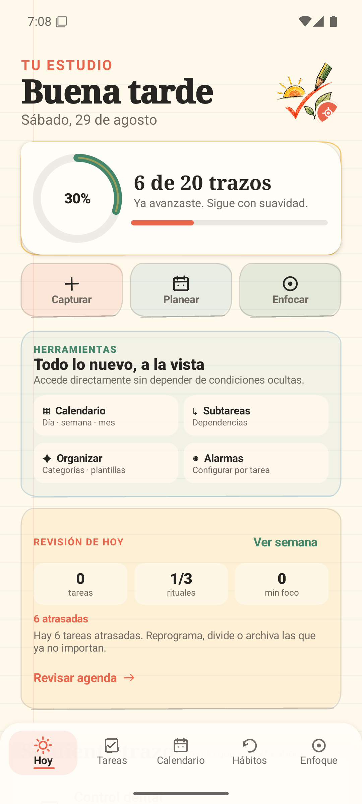
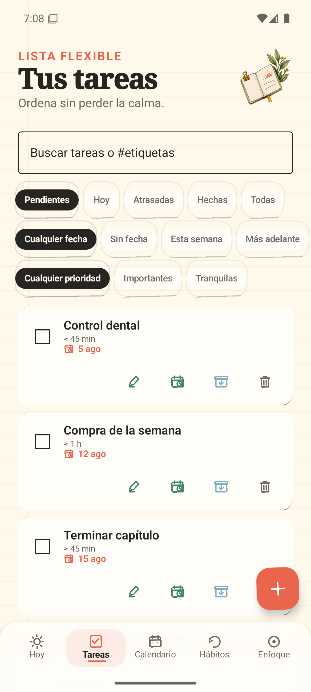
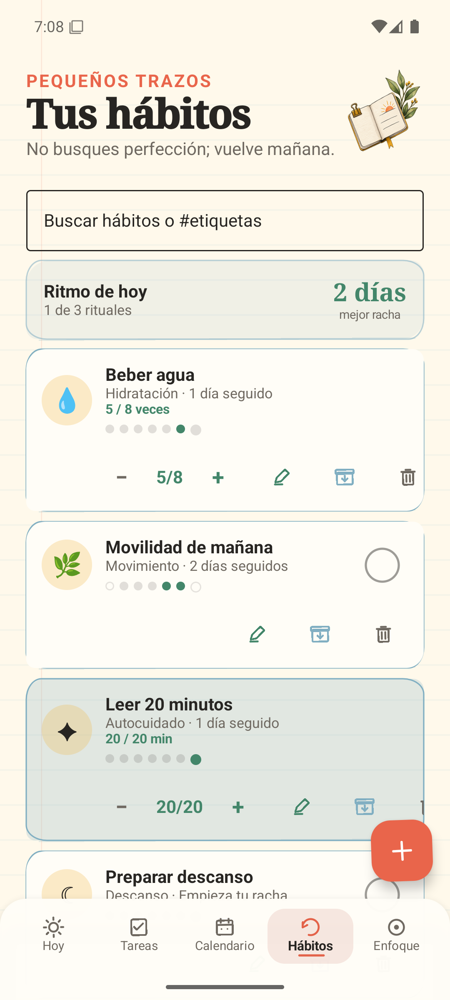
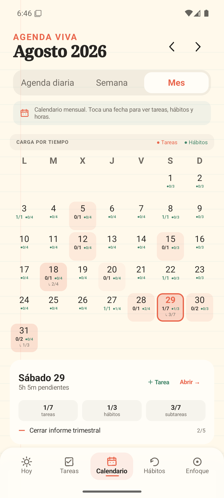
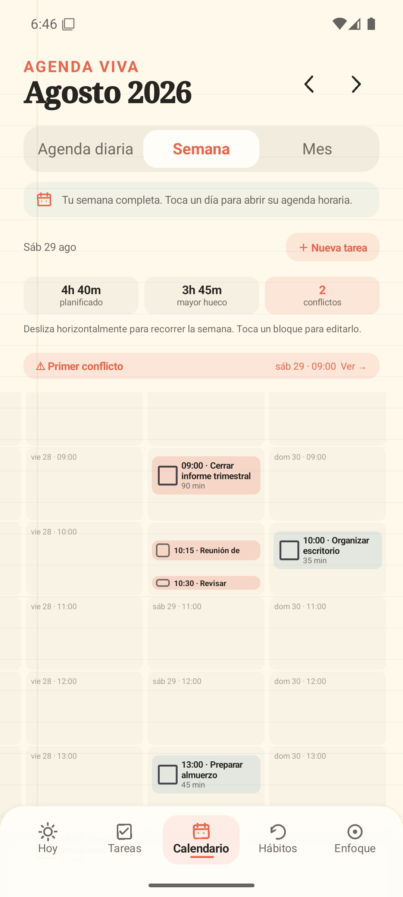
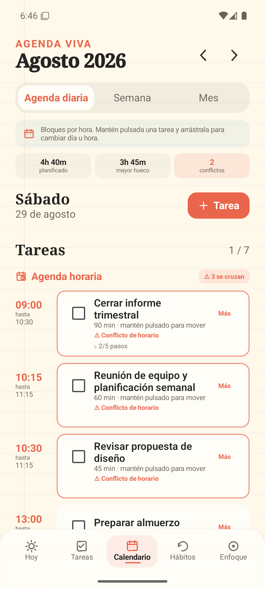
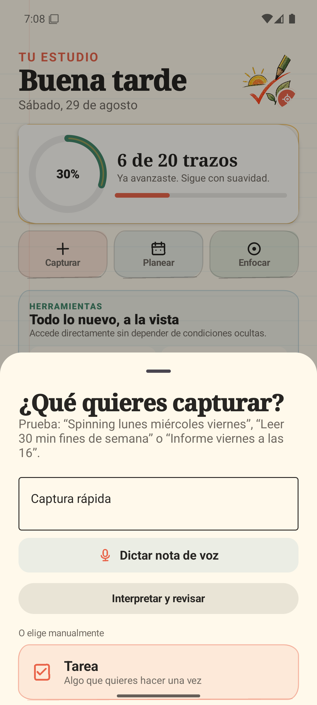
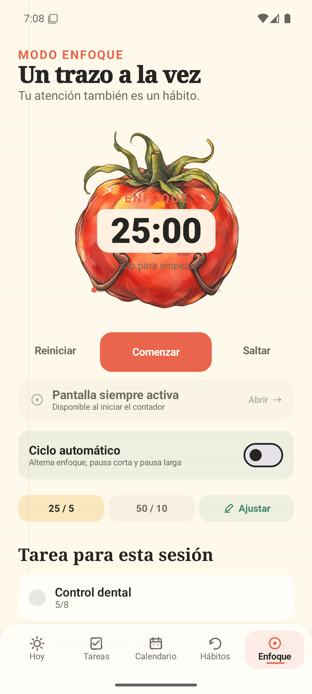
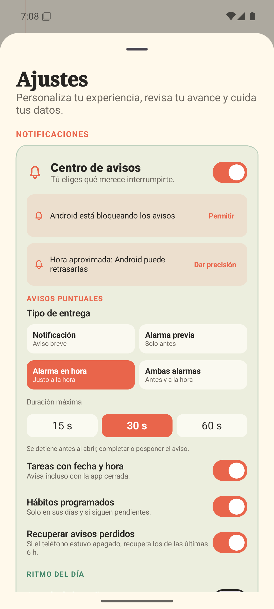

# Trazo

[](https://github.com/rck1996/trazo/actions/workflows/android-ci.yml)
[](https://github.com/rck1996/trazo/releases/latest)
[](https://developer.android.com/about/versions/oreo)
[](#privacidad)

Trazo es una aplicación Android para organizar tareas, hábitos, calendario y sesiones de enfoque en un único espacio privado. Funciona sin cuenta ni conexión y combina una experiencia moderna con ilustraciones tipo *sketch*, papel pautado y microinteracciones discretas.

## La experiencia

<p align="center">
  
  
  
</p>

**Hoy** reúne lo que importa, **Tareas** permite planificar desde una acción sencilla hasta un proyecto con subtareas y **Hábitos** muestra metas, rachas y registros diarios sin perder el estilo de cuaderno dibujado.

## Planificación que se entiende de un vistazo

<p align="center">
  
  
  
</p>

El calendario ofrece tres niveles complementarios:

- **Agenda diaria:** bloques por hora, progreso de subtareas y conflictos visibles.
- **Semana:** carga planificada, hueco disponible y acceso directo al primer cruce.
- **Mes:** intensidad por tiempo pendiente y progreso separado de tareas, hábitos y subtareas.

Los bloques se pueden reprogramar con precisión de 15 minutos y las tareas sin hora siguen formando parte de la carga real del día.

## Captura y enfoque

<p align="center">
  
  
  
</p>

- La captura inteligente interpreta frases en español como `Spinning lunes miércoles viernes` o `Informe viernes a las 16` y permite dictarlas por voz.
- El Pomodoro admite ciclos `25/5`, `50/10` y tiempos personalizados, tarea asociada, pausa/reinicio correctos, notificación persistente y modo de pantalla siempre activa.
- La ilustración cambia entre enfoque y descanso, respeta el movimiento reducido y mantiene disponible un modo minimalista monocromático.
- Cada tarea o hábito puede usar notificación, alarma previa, alarma a la hora o ambas, independientemente de la preferencia general.

## Funciones incluidas

### Tareas y organización

- Crear, editar, completar, archivar, restaurar y eliminar tareas con acción **Deshacer**.
- Fechas, horas, duración, prioridad, repetición, categorías, etiquetas y notas.
- Subtareas marcables con progreso `2/5` y dependencias entre pasos.
- Plantillas reutilizables y filtros combinables por texto, estado, fecha y prioridad.
- Archivo independiente de la papelera y copias de seguridad JSON importables.

### Hábitos

- Días personalizados, intervalos semanales y excepciones concretas.
- Metas por veces, minutos o pasos con ajuste directo del progreso.
- Rachas calculadas sólo sobre días programados e historial visual semanal.
- Categorías compartidas e ilustraciones para hidratación, movimiento, autocuidado, alimentación y descanso.

### Avisos y seguimiento

- Alarmas puntuales incluso con la app cerrada, recuperación tras reinicio y acciones `Hecho`, `+10 min` y `+30 min`.
- Diagnóstico de permisos, próximo aviso, último envío y prueba audible del modo elegido.
- Resumen matinal, cierre nocturno configurable y estadísticas semanales de tareas, hábitos y Pomodoro.
- Seis widgets interactivos: resumen diario, hábito rápido, temporizador, próximas tareas, jardín de rituales y captura inteligente.

### Apariencia y accesibilidad

- Tema claro, oscuro o de sistema con contraste adaptado.
- Modo minimalista completamente blanco y negro.
- Texto ampliado, animaciones reducidas y respuesta háptica configurable.
- Estados vacíos accionables, objetivos táctiles amplios y descripciones para controles principales.

## Descargar e instalar

Descarga el APK desde la [última versión publicada en GitHub](https://github.com/rck1996/trazo/releases/latest). La compilación verificada de esta documentación también está disponible como [Trazo 3.8.0 en Google Drive](https://drive.google.com/file/d/1jvf5sLjuhvF-vkcWpzZ_ZYqx-WdnCKmp/view?usp=drivesdk).

En Android, permite temporalmente la instalación desde la aplicación con la que abras el archivo y toca el APK para instalarlo.

> Los APK actuales son compilaciones de prueba firmadas localmente y pensadas para instalación directa. No son paquetes de Google Play.

## Ejecutar el proyecto

1. Abre esta carpeta con Android Studio Quail 1 (2026.1.1) o compatible.
2. Usa JDK 17 y permite que Android Studio instale Android SDK 36 si lo solicita.
3. Sincroniza Gradle y ejecuta el módulo `app` en un emulador o dispositivo Android 8.0+.

El proyecto utiliza AGP 9.2.1, Gradle 9.4.1, Kotlin/Compose Compiler 2.3.21, Android SDK 36 y Compose BOM 2026.06.00.

Para instalar la compilación local mediante ADB:

```powershell
adb install -r -t artifacts\Trazo-3.8.0-debug.apk
```

## Arquitectura mínima

```text
UI Compose → TrazoViewModel → LocalStore → SharedPreferences / JSON
                      ↓
               modelos inmutables
```

Trazo no incorpora cuentas, red, analítica, inyección de dependencias ni una base de datos innecesaria. `LocalStore` mantiene un campo de versión para permitir migraciones y copias portables.

## Privacidad

Trazo no crea cuentas ni envía tareas, hábitos, grabaciones o estadísticas a servidores. La captura por voz usa el reconocedor configurado en Android y conserva únicamente el texto confirmado. Las copias de seguridad sólo se crean cuando la persona las exporta mediante el selector de archivos del sistema.

## Verificación

La versión 3.8.0 fue comprobada con datos densos y conflictos horarios en un emulador Pixel API 35. La validación incluye:

```bash
./gradlew testDebugUnitTest
./gradlew lintDebug
./gradlew assembleDebug
./gradlew connectedDebugAndroidTest
```

- Pruebas unitarias de rachas, recurrencia, parser, filtros, alarmas, transiciones de Pomodoro y calendario.
- Android Lint y compilación completa del APK.
- Cuatro pruebas instrumentadas de navegación, calendario mensual y subtareas.
- Revisión visual de Hoy, Tareas, Hábitos, Captura, Enfoque, Ajustes y las tres vistas del calendario.

Consulta [docs/BITACORA.md](docs/BITACORA.md) para seguir el desarrollo y [docs/VALIDACION.md](docs/VALIDACION.md) para revisar la evidencia de pruebas.

## CI/CD

- Cada *push* o *pull request* hacia `main` ejecuta pruebas unitarias, Android Lint y compilación del APK.
- Dependabot revisa semanalmente las dependencias de Gradle y GitHub Actions.
- Una etiqueta semántica `vX.Y.Z` comprueba que versión, código y APK coincidan y publica el instalador con su checksum SHA-256.

## Próxima etapa: una experiencia más personal

La siguiente evolución de Trazo se centrará en simplificar sin perder potencia. Esta etapa está **planificada, todavía no implementada**, y contempla:

- Tres composiciones de Hoy: **Enfoque**, **Equilibrado** y **Panorama**.
- Ajustes organizados como secciones completas en lugar de una única hoja extensa.
- Creación progresiva: lo esencial primero y las opciones avanzadas bajo demanda.
- Introducción breve para usuarios nuevos y recorrido opcional de novedades.
- Búsqueda y filtros consistentes en tareas, hábitos y calendario.
- Alternativa accesible al arrastre para mover bloques de la agenda.
- Una composición de Pomodoro todavía más limpia y mayor cobertura con TalkBack.

La prioridad seguirá siendo la misma: una aplicación privada, rápida, artística y serena que ayude a avanzar un trazo a la vez.
